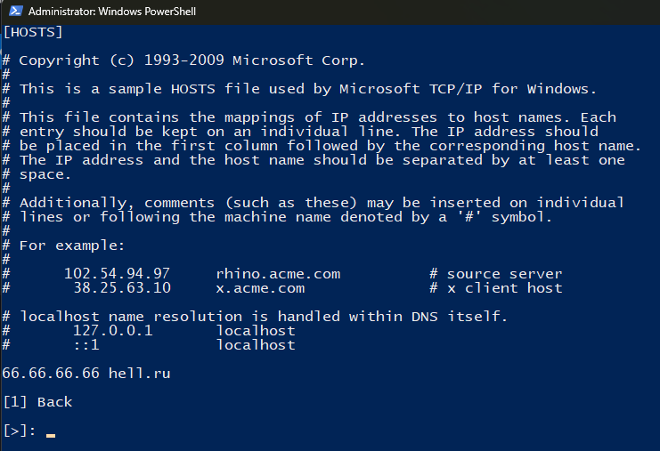

# Program "Hosts"
## The program serves for convenient management of the hosts file, without powershell modules  
*Created for himself, but maybe someone will be useful*
## Getting started with the program
- It runs through **Run.bat**. Runs script on behalf of the administrator, to successfully execute the command.
- **Uninstall.bat** removes the working directory "C:\data\program\progHosts", which serves to save the hosts file.
## Program interface
### Main meny
The main menu contains options for adding a DNS record, viewing the contents of a hosts file, or removing a DNS record.  

### Add DNS record menu
The Add Record menu is waiting for user input (DNS name IP addr).  

### View menu
View the contents of the hosts file.

### RM menu
Removes DNC records, as well as saving the host file to the working directory.  
Deletion occurs by DNS name.  
**The script does not contain a user input check, because I don’t think this script will be used by anyone other than me, so be careful.**  

